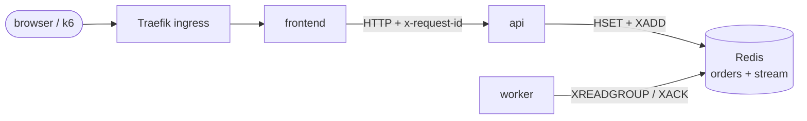
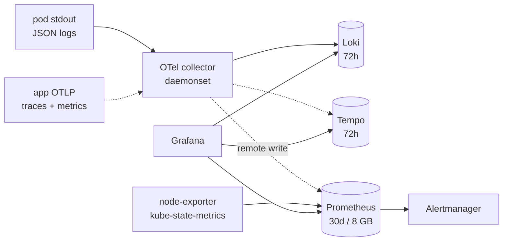

# slo-driven-observability-stack

A three-service app on single-node Kubernetes, built to practise the reliability side of
running software: deciding what "working" means for users, measuring it, alerting when the
error budget burns too fast, and breaking things on purpose to see if the signals hold up.

The app is a small coffee-bean shop. It is deliberately boring so the interesting part is
the operations around it.

It runs on one Oracle Cloud free-tier ARM VM (4 OCPU, 12 GB). That is a constraint I chose,
not an oversight: it costs nothing, and fitting Prometheus, Loki, Tempo, Grafana, Argo CD
and the app into 12 GB makes capacity a real problem instead of a theoretical one. It is a
lab. It does not prove high availability, and nothing here is production traffic.

## Status

Work in progress, built in milestones.

| | Milestone | State |
|---|---|---|
| 1 | Baseline app with a tested failure contract | done: services, 29 tests, structured logs, fault injection |
| 2 | k3s platform, config, CI | written (Terraform, kustomize, Helm values, CI); first deploy to the VM pending |
| 3 | OpenTelemetry metrics, logs, traces | backends and collector configured; app instrumentation not started |
| 4 | SLOs, error budgets, burn-rate alerts | not started |
| 5 | Failure experiments, incident drill, runbooks | fault hooks exist; experiments not run yet |
| 6 | Capacity report, write-up | not started |

## How it fits together

Request path:



Telemetry path (dashed parts arrive in milestone 3):



| Service | Does | Endpoints |
|---|---|---|
| frontend | Serves the page and proxies to the api. | `/`, `/products`, `/checkout`, `/orders/{id}`, `/healthz` |
| api | Catalog and order intake. Writes the order to Redis and queues it on a stream. | `/products`, `/orders`, `/orders/{id}`, `/healthz`, `/readyz`, `/admin/faults` |
| worker | Consumer group on the stream. Marks orders fulfilled and reclaims work a dead consumer never acked. | none (heartbeat file for liveness) |

The three user journeys the SLOs will be built around:

1. **Browse**: `GET /products` returns quickly.
2. **Place an order**: `POST /checkout` is accepted.
3. **Get it fulfilled**: an accepted order reaches `fulfilled` within some time bound.

The third one is the interesting one. Every HTTP request can succeed while orders sit in a
queue, so request success rate alone would hide a broken worker.

## What happens when things break

Each row is defined behaviour, covered by tests where it is application logic.

| Failure | What users see | Why |
|---|---|---|
| Redis down | Orders fail with 502 from the frontend | The api answers 503 and fails readiness; the frontend maps any api 5xx to 502. Liveness keeps passing, so nothing restarts in a loop. |
| Redis down, in k8s | Even `/products` fails, though it never touches Redis | The unready api pod leaves the Service. Known trade-off, kept on purpose as a talking point and a candidate fix. |
| api slower than 2s | 504 from the frontend | The frontend's api client timeout is 2s (`API_TIMEOUT_SECONDS`). |
| Worker stopped or slow | Orders stay `pending`, nothing is lost | Messages wait in the stream and drain when the worker returns. |
| Worker dies mid-message | Order still gets fulfilled, late | Unacked messages idle for 60s are claimed by another consumer. Handling is idempotent, so redelivery is safe. |
| Malformed or unknown input | 422 | The frontend checks shape before calling the api; the api checks the product exists. |
| Missing config | Pod in CrashLoopBackOff with one clear log line | Required settings are checked at startup; exit code 2. |
| Redis memory full (200 MB) | Orders fail with 502 | `noeviction`, so Redis refuses writes instead of silently dropping orders. |

## Design decisions

- **One image, three entrypoints.** `python -m shop api|frontend|worker`. One build and one
  ARM64 image to push; each Deployment still rolls out and rolls back on its own.
- **Redis Streams, not Kafka.** Consumer groups, acks and redelivery give at-least-once
  delivery inside a 256 MiB container. Kafka would eat the memory budget to prove nothing extra here.
- **Liveness is the process, readiness is the dependency.** A Redis outage should take the
  api out of rotation, not restart it.
- **The frontend's readiness ignores the api.** An api outage should show users an error
  page, not make the whole site disappear.
- **Request ID across services.** The frontend accepts or creates `x-request-id`, logs
  it, and forwards it. Junk values are replaced, not forwarded. Logs record the route
  template (`/orders/{order_id}`), never the raw path, to keep cardinality bounded.
- **Open-model load.** The k6 profile uses arrival rates, not a fixed number of virtual
  users, so a slow backend shows up as latency and dropped requests instead of quietly
  lowering the traffic.
- **30-day Prometheus retention, 72h for logs and traces.** A 30-day SLO window has to fit
  in Prometheus; logs and traces are for debugging recent incidents.
- **No public Kubernetes API.** Port 6443 stays closed and kubectl goes through an SSH
  tunnel. Ports 22, 80 and 443 only accept one admin CIDR, enforced by Terraform validation.

## Running it

### Locally

Needs Docker, or just [uv](https://docs.astral.sh/uv/) for the tests.

```sh
docker compose up --build
scripts/smoke.sh http://localhost:8080      # one order, end to end
```

The shop page is at http://localhost:8080 and the api at http://localhost:8000.

```sh
uv sync
uv run pytest        # no Redis or Docker needed (fakeredis + mocked transport)
uv run ruff check .
```

### Breaking it on purpose

```sh
# 20% errors and 300ms extra latency on api business routes. Probes are unaffected.
curl -X PUT localhost:8000/admin/faults -H 'content-type: application/json' \
  -d '{"error_rate": 0.2, "delay_ms": 300}'

# turn it off
curl -X PUT localhost:8000/admin/faults -H 'content-type: application/json' -d '{}'

# build a backlog: each order takes 3s to fulfil
WORK_MS=3000 docker compose up -d worker

# steady traffic
k6 run -e BASE_URL=http://localhost:8080 -e DURATION=10m loadgen/baseline.js
```

`/admin/faults` is not routed through the ingress. In the cluster, use
`kubectl -n shop port-forward svc/api 8000`.

### On Oracle Cloud

Needs Terraform, kubectl, Helm, openssl and an OCI CLI profile.

```sh
cd infra
cp terraform.tfvars.example terraform.tfvars    # region, OCIDs, your IP as /32
terraform apply                                  # VCN, subnet, A1 VM; cloud-init installs k3s
```

```sh
IP=$(terraform -chdir=infra output -raw public_ip)
ssh ubuntu@$IP sudo cat /etc/rancher/k3s/k3s.yaml > ~/.kube/slo-lab.yaml
ssh -N -L 6443:127.0.0.1:6443 ubuntu@$IP &       # kubectl goes through this tunnel
export KUBECONFIG=~/.kube/slo-lab.yaml

scripts/bootstrap-cluster.sh    # secrets, observability charts, Argo CD, app
scripts/smoke.sh http://$IP
```

A1 capacity is often exhausted in one availability domain. If launch fails with "out of
host capacity", set `availability_domain_index` to another domain.

Grafana and Argo CD stay private:

```sh
kubectl -n observability port-forward "$(kubectl -n observability get pod -l app.kubernetes.io/name=grafana -o name)" 3000
kubectl -n observability get secret grafana-admin -o jsonpath='{.data.admin-password}' | base64 -d

kubectl -n argocd port-forward svc/argocd-server 8443:443
kubectl -n argocd get secret argocd-initial-admin-secret -o jsonpath='{.data.password}' | base64 -d
```

## Delivery

GitHub Actions on every push and pull request:

| Job | Checks |
|---|---|
| test | `uv sync --locked`, ruff lint and format, pytest |
| manifests | renders each kustomize overlay and validates it with kubeconform |
| terraform | `fmt -check`, `validate` |
| secrets | gitleaks over the full history |
| image | on `main` only: amd64 + arm64 build, pushed to `ghcr.io/pranshu-raj/shop:<sha>` |

Argo CD syncs `deploy/k8s/overlays/lab` from `main` with prune and self-heal on. A release
is a commit that sets the overlay's `newTag` to a pushed sha; rolling back is reverting
that commit. The image's git sha is baked in as `APP_VERSION` and appears on every log line.

## Secrets

Nothing secret is in git. `scripts/bootstrap-cluster.sh` generates the Redis password
(`shop/redis-auth`) and the Grafana admin password (`observability/grafana-admin`) the
first time it runs and never overwrites them. The Redis URL is assembled inside the pod
from the secret, and logs only ever show it redacted (`redis://:***@redis:6379/0`).

To rotate the Redis password:

```sh
kubectl -n shop delete secret redis-auth
scripts/bootstrap-cluster.sh
kubectl -n shop rollout restart deploy/redis deploy/api deploy/worker
```

## Resource budget

Memory limits as configured. They are not measurements yet; milestone 6 replaces this
with real numbers.

| Group | Memory limit |
|---|---|
| shop (frontend, api, worker, redis) | ~0.95 GiB |
| Prometheus, Alertmanager, operator, exporters | ~2.5 GiB |
| Loki, Tempo, OTel collector | ~2.1 GiB |
| Grafana | 0.4 GiB |
| k3s system + kube reserved, eviction threshold | ~1.5 GiB |
| Argo CD | unbounded (upstream defaults) |

## Cost

Zero, as long as the VM stays inside Oracle's Always Free limits (A1 up to 4 OCPU / 24 GB,
200 GB block storage). With the repo and its GHCR image public, Actions minutes and image
storage are free too.

## Known limitations

- One node: a VM reboot is a full outage, and the cluster's state lives on its boot volume.
- Persistent volumes use k3s `local-path`. There are no backups.
- No TLS on the ingress, and access is restricted to one IP instead.
- `/admin/faults` has no auth. It is only reachable from inside the cluster.
- Fault settings live in process memory, so they apply to one api pod and reset on restart.
- Orders expire from Redis after 24h. A message redelivered after that recreates a partial record.

## Layout

```
shop/                services (api, frontend, worker) and shared config, logging, order store
tests/
loadgen/             k6 traffic profiles
deploy/k8s/          kustomize base and the lab overlay
deploy/helm/         values for kube-prometheus-stack, loki, tempo, otel collector
deploy/argocd/       Argo CD application
infra/               Terraform for the OCI network and VM; k3s via cloud-init
scripts/             cluster bootstrap, smoke test
docs/runbooks/       one per paging alert
docs/experiments/    dated failure experiments
```
